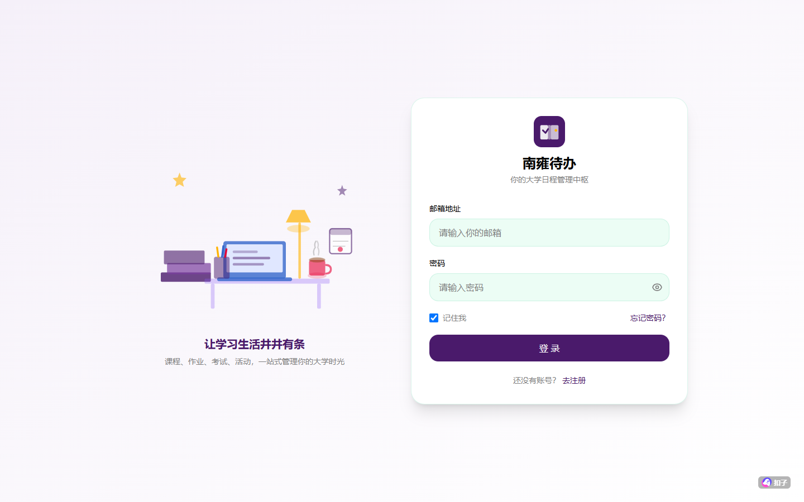
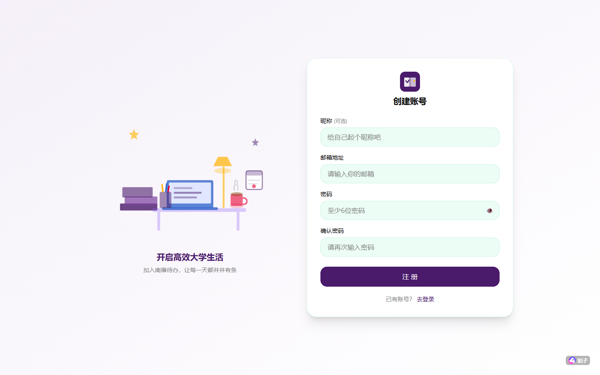

# 🎓 南雍待办（NanyongToDo）

> **你的大学日程管理中枢** —— 面向在校大学生的智能待办应用，融合学术日历、智能任务解析、多视图规划与紧急提醒。



## ✨ 核心特色

| 功能 | 说明 |
|------|------|
| 📥 **双入口任务导入** | 问卷式结构化导入 + AI 智能解析（粘贴课程表/通知文本，AI 自动提取结构化待办） |
| 📊 **多视图看板** | 日视图（时间轴）/ 周视图切换、月历视图（类型彩色圆点 + 悬停提示） |
| 🔥 **迫在眉睫** | 实时倒计时展示最紧急的 3 条任务（天/时/分/秒每秒刷新） |
| 🎨 **主题系统** | 4 种配色（南大紫/青绿/天空蓝/金色）× 4 种风格（自然/现代/南哪/自定义背景） |
| 👤 **用户系统** | 邮箱注册 + 验证邮件、JWT 登录、记住我、个人资料 |
| 🏷 **标签管理** | 自定义标签与颜色 |
| 📅 **日历导出** | 一键导出 .ics 文件，兼容 iOS / Android 系统日历 |

## 🚀 在线体验

**生产环境：** https://3t9zdpbfxq.coze.site

注册账号即可体验全部功能。

## 🖥 界面预览

### 登录页


### 注册页


## 🛠 技术栈

- **框架：** Next.js 16 (App Router) + React 19
- **语言：** TypeScript 5（strict 模式）
- **样式：** Tailwind CSS 4 + shadcn/ui 组件库
- **数据库：** Supabase (PostgreSQL) + RLS 行级安全
- **认证：** Supabase Auth + JWT
- **AI 解析：** OpenAI 兼容接口（支持用户自备 API Key：OpenAI / 智谱 / 文心等）

## 📦 本地开发

```bash
# 安装依赖（仅支持 pnpm）
pnpm install

# 启动开发服务器
coze-dev dev
# 或
pnpm dev
```

## 📁 项目结构

```
src/
├── app/                  # 页面路由（App Router）
│   ├── dashboard/        # 主看板（日/周视图、月历、迫在眉睫）
│   ├── add/              # 添加任务（问卷式 + AI 解析）
│   ├── tasks/            # 全部任务
│   ├── tags/             # 标签管理
│   ├── settings/         # 设置（主题/紧急阈值/AI Key）
│   ├── login/            # 登录
│   ├── register/         # 注册
│   └── api/              # API 路由
├── components/           # UI 组件（shadcn/ui）
├── hooks/                # 自定义 Hooks
└── lib/                  # 工具库与上下文
```

## 🔒 隐私说明

- **AI 解析 API Key 仅保存在浏览器本地**，不会上传或存储到服务器
- 数据库密钥通过环境变量注入，不写入代码仓库
- 支持 RLS 行级安全，用户数据互相隔离

## 📄 许可证

仅供学习交流使用。
